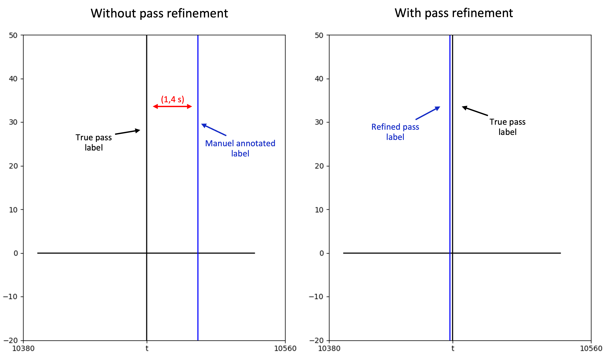

Tracking technology has many applications in soccer and other sports domains. Yet, for more sophisticated analysis regarding team and player behaviors, companies (OptaSports 2021) provide (professional) clubs with additional match and player events such as shots, passes, etc. However, in this work, we have empirically shown that this event data is often temporally imprecise. To counteract this issue and allow for exact pass annotations this work has presented a novel framework for pass event refinement based on existing event data. In a first step, features for player-ball distance and ball acceleration, obtained from the spatiotemporal position data, were extracted to construct a naive Bayes classifier that performs a general pass event detection. Subsequently, this classifier was employed to refine the existing pass events from the event data to fit the expert annotation. In this process, the classifier generates a respective confidence score which we further applied for the detection of localization errors, i.e. an inaccurate location of the ball, in the position data. Experimental results have shown the superiority of the proposed solution in terms of the temporal accuracy of refined pass events compared to the annotations of existing event data and to another statistical baseline. This statistical baseline addresses the systematic error of delayed pass annotations in the original event data.

{: .mx-auto.d-block :}

Furthermore, an in-depth analysis of the various system parameters was conducted and has shown the robustness of the system as well as the efficiency of an outlier detection that removes unreliable positional data points. Parameter settings with various complexity were investigated and results have demonstrated that a lightweight solution can already improve the temporal accuracy of passes drastically. Due to the absence of a public test benchmark and common evaluation protocol, the overall performance of our proposed solution was discussed in relation to results from another more complex state-of-the-art approach for pass detection. Better performance was investigated for two out of three evaluation metrics. In the future, we assume a more significant improvement when utilizing data from video tracking systems or positioning systems (including three dimensional ball position). Finally, we believe that, given a sufficiently large sample size of manual annotations, our algorithm may be modified to other events in the event data (e.g., shots and tacklings) to enable the synchronization with the position data.

{: .mx-auto.d-block :}

The diagram illustrates the Work ow of the proposed algorithm. On the left, the input data and the involvement in the respective steps of the algorithm is displayed. On the right, an exemplary sequence for player-ball distance (cyan curve, in m) and ball acceleration (orange curve, in m/s2 ) for different steps of the algorithm are presented. The bottom two plots on the right part include the respective expert pass label (green line), the imprecise pass label (red line), and the refined pass label (black line, quantitative) which is computed from the algorithm's pass event probabilities P(w) (black curve).
