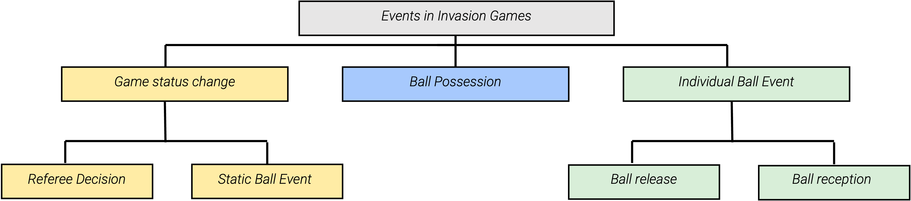

Events play an important role for the interpretation of complex invasion games like soccer, handball, hockey, or basketball and are therefore of high interest. Over the last years, three fundamental perspectives emerged with regard to the analysis of sports games, which all value different characteristics of the respective sports: 
1. The Machine learning (ML) perspective aims to find automatic solutions for specific tasks. This perspective is just content with the results and accepts that performance is never perfect.
2. The sports science domain demands on semantically precise descriptions of the individual developments to analyze success factors. In contrast to the ML perspective, the sports science perspective is very interested in the events that were not recognized by the model and it will try to characterize the missing percentage to find similarities that are important for the description of the sport. 
3. Finally, the practicioners who do not care about the recognition of events alone but they would rather like to evaluate their impact. They are interested in i.e the immediate impact of specific modification of training or tactics. 
{: .mx-auto.d-block :}

While the general objective to understand and exploit the underlying concepts in the sports is common to all perspectives, synergistic effects are barely observed. At least for soccer there is quite a lot related work on the ML and the sport science perspective.

Descriptive statistical analysis such as possession or shot frequency rely on events that occur on the pitch. However, collecting semantic and (spatio-) temporal properties for events during matches is on-trivial, highly dependent on the underlying definitions, and is, in the case of (accurate) manual annotations, very time-consuming and expensive. Nevertheless it is a common practice of data providers for (certain) matches in professional sport to delegate the annotation of events to human annotators. Various approaches have been suggested to automate the process. In this respect, the automatic detection of (spatio-) temporal events has been addressed for (broadcast) video data and positional data. However, due to ambigious definitions of the events and the fact that public datasets are very rare, both manual annotations and automatic detection of events do not fulfill a gold standard in annotation quality. Even though the sports science perspective offers some taxonomies there is no global annotation scheme or event taxonomy that covers various fine grained events that can be evaluated with few meaningful metrics to set a gold standard.

The aim and contribution is to create a taxonomy that is valid for invasion games in general and can be applied to all invasion games with a sport-specific refinement of the base events.
In the creation process we consider the following attributes:
1. We aim for a hierarchical structure with increasing semantics from top to bottom levels.
2. We want to enable a minimal annotation without redundancies.
3. Although minimal, we want to enable annotations that are still exact and objective.
4. The approach should be easily refined and expanded
{: .mx-auto.d-block :}

In addition to the taxonomy, which can be seen above, a dataset was released. On this dataset a detailed evaluation on the human annotators performance and an exemplary baseline for event recognition from video data was executed. The results, which can be viewed in detail in the paper, suggest that the base taxonomy does generally not require expert knowledge. This observation shows the low amount of semantic interpretation included in our proposed taxonomy.

<!--- In summary, we observe a lack of a common consensus for the majority of events in the sport. Neither precise definitions of individual events nor the temporal annotation or evaluation process are consistent. Publicly available datasets are uni-modal, focus on soccer, and often consider only a small subset of events that does not reflect the entire match. These inconsistencies make it for all aforementioned three perspectives difficult to assess the performance of automatic systems and to identify state-of-the-art approaches for the real-world task of fine-grained and ball-centered event spotting from multimodal data sources.

In this paper, we target the aforementioned problems and present several contributions: 1) We propose a unified taxonomy for lowlevel, and high-level ball-centered events in invasion games and exemplary refine it to the specific requirements of soccer and handball. This is practicable as most invasion games involve various shared motoric tasks (e.g., a ball catch), which are fundamental to describe semantic concepts (involving intention and context from the game). 2)We release two multimodal benchmark datasets (video and audio data for soccer (EIGD-S), synchronized video, audio, and positional data for handball (EIGD-H)) with gold-standard event annotations for a total of 125 minutes of playing time per dataset. These datasets contain frame-accurate manual annotations by domain experts performed on the videos based on the proposed taxonomy (see Figure 1). 3) Lastly an I3D [10] model for video chunk classification is adapted for the spotting task using a sliding window and non-maximum suppression and is applied.

 
 A common practice for soccer matches in top-flight leagues is to (manually) capture event data.

 Hence, we argue that the structure of our taxonomy can be applied to all invasion games with a sport-specific refinement of the base events.

 Characteristics for the design of the taxonomy:
 (1) A hierarchicalarchitecture, in general, is a prerequisite for a clear, holisticstructure. We aim to incorporate a format that represents a broad(general) description of events at the highest level and increases indegree of detail when moving downwards in the hierarchy.

 (2)We target our taxonomy to be minimal and non-redundant since these characteristics require individual categories to be welldefined and clearly distinguishable from others. In this context, a specific event in the match should not relate to more than one annotation category to support a clear, unambiguous description of the match.

(3) The taxonomy needs to enable an exact description of the match. While the previously discussed minimal, non-redundant design is generally important, an overly focus on these properties may disallow the description of the exact developments in a match.

(4) Finally, we aim for a modular expendable taxonomy. This allows for a detailed examination of specific sports and concepts while still ensuring a globally valid annotation that is comparable (and compatible) with annotations regarding different sports and concepts.

The mi- nor discrepancies in the performance of the experienced and the inexperienced annotator for EIGD-S-T also indicate that a sufficient annotation of our base taxonomy does generally not require expert knowledge. This observation shows the low amount of semantic interpretation included in our proposed taxonomy.  --->
